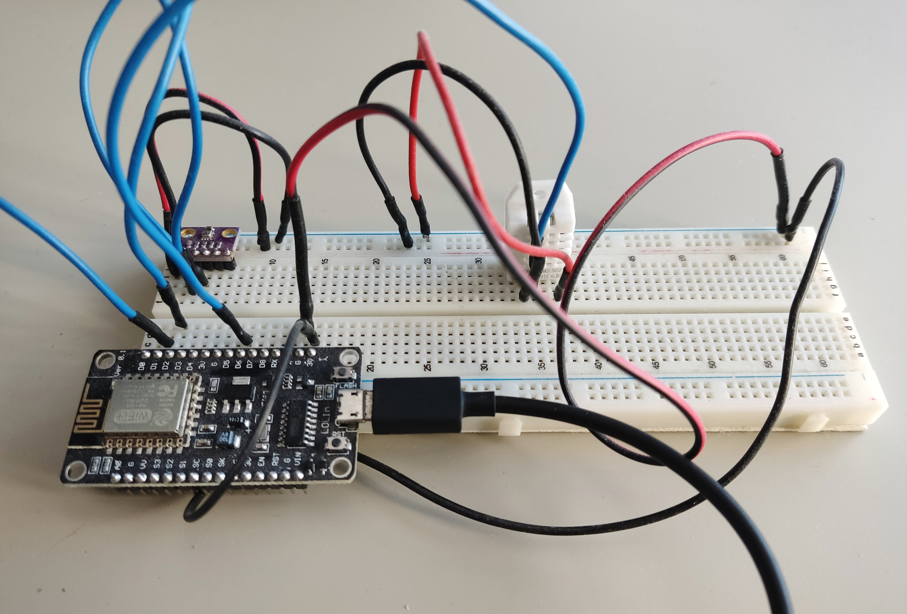

This project contains 3 directories:

- client - Typescript React app
- server - Node.js backend
- device - c++ app

## Client

App was bootstrapped with [Create React App](https://github.com/facebook/create-react-app) with TypeScript support.

Used libraries:

- [Amcharts](https://amcharts.com)
- [Material-UI](https://material-ui.com)

## Server

This is a simple REST backend which is storing new measurements received from weather station and provides results to the client app.

Used libraries:

- [MongoDB](https://www.mongodb.com/)
- [Mongoose](https://mongoosejs.com/)
- [Express](https://expressjs.com/)

## Device - heart of the system!

Weather station is running on [NodeMCU](https://en.wikipedia.org/wiki/NodeMCU) microcontroller. Currently it's powered by usb charger. I will consider powering it by 18650 baterries or powerbank in the future.

Sensors:

- BME 280 pressure, temperature and humidity sensor
- DHT22 temperature and humidity sensor

## Demo

Open [http://weather.iskrzycki.usermd.net](http://weather.iskrzycki.usermd.net) to view live front-end part.

## Hosting

Both frontend and backend are hosted on [MyDevil](https://www.mydevil.net/) which is Node.js hosting solution.
Frontend app is automatically build & deployed by Github action on each code push.

## TODO device

[ ] Better time measuring (millis instead of delay?)
[ ] sleep between measurements
